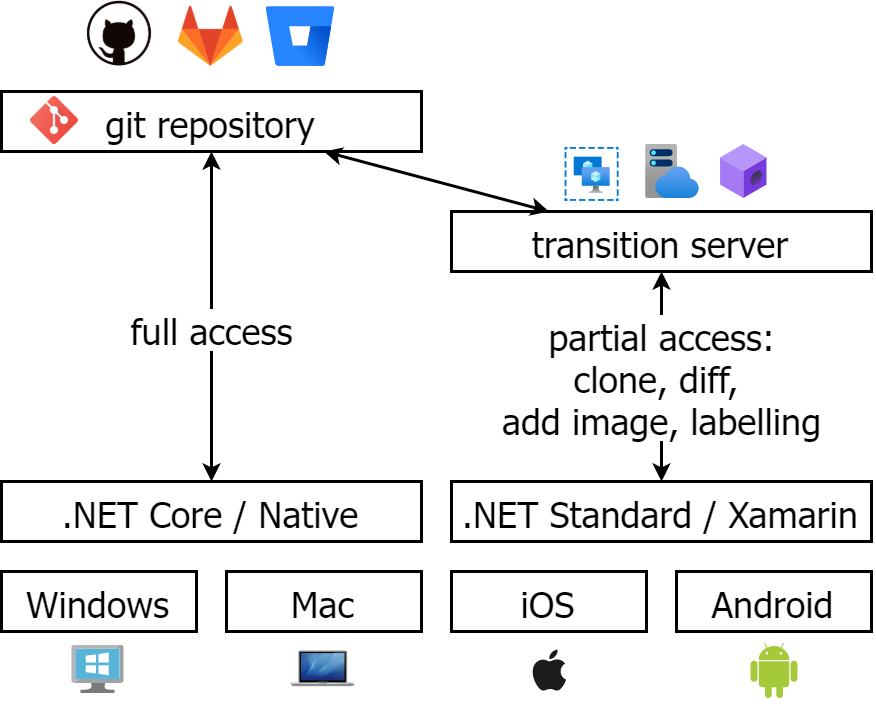

# YuzuMarker

[WIP] 次世代漫画汉化工具。本项目主要想要实现漫画汉化过程中多人协作，让工作流程简单化、系统化。

# 架构

<div align="center">
	
</div>

# 功能

预期实现功能：

🚧: WIP, 🕒: Not yet started, ⚠: Warning, ✅: Finished, ❌: Abandoned

* 🚧 专用文件格式
  * 🚧 一般格式
    * ✅ 图片资源
    * 🚧 PSD 资源
    * ✅ 录入文本
    * 🚧 涂白设置
    * 🚧 嵌字设置
    * ✅ IO 框架
  * 🚧 资源文件加密支持
* 🚧 Photoshop 自动导出
  * ✅ 兼容层
  * ❌  COM 方案 [Deprecated, 停止开发]
  * 🚧 [CEP 方案](https://github.com/JeffersonQin/YuzuMarker.Photoshop)
  * 🕒 UXP 方案 (等待这个方案成熟后再开工)
* 🚧 文字块自动识别
* 🚧 [字体自动识别](https://github.com/JeffersonQin/YuzuMarker.FontDetection)
* 🚧 [字体布局半自动化](https://github.com/JeffersonQin/YuzuMarker.TextAutoLayout)
* 🚧 翻译标注部分
* 🚧 校对部分
* 🚧 嵌字部分

# 关于文件格式的设计

```
<project-name>                            # 项目文件夹
├── <project-name>.yuzu                   # 项目文件
├── Images                                # 图片文件夹
|   ├── <image-file-1>                    # 图片 1
|   ├── <image-file-2>                    # 图片 2
|   ├── ...
|   └── <image-file-n>                    # 图片 n
├── PSD                                   # PS 文件夹
|   ├── <image-file-1>.psd                # 图片 1 对应的 .psd
|   ├── <image-file-2>.psd                # 图片 2 对应的 .psd
|   ├── ...
|   └── <image-file-n>.psd                # 图片 n 对应的 .psd
└── Notations                             # 简单文本标注文件夹
    ├── <image-file-1>                    # 图片 1 对应的标注文件夹
    |   ├── index.json                    # 图片 1 标注时间戳索引
    |   ├── <timestamp-1>-simple.json     # 图片 1 的 第1个普通标注
    |   ├── <timestamp-1>-<type>.json     # 图片 1 的 第1个其他种类的标注
    |   ├── ...
    |   ├── <timestamp-2>-simple.json     # 图片 1 的 第2个普通标注
    |   ├── <timestamp-2>-<type>.json     # 图片 1 的 第2个其他种类的标注
    |   ├── ...
    |   ├── <timestamp-m>-simple.json     # 图片 1 的 第m个普通标注
    |   ├── <timestamp-m>-<type>.json     # 图片 1 的 第m个其他种类的标注
    |   └── ...
    ├── <image-file-2>                    # 下同
    |   ├── index.json                    # 图片 2 标注时间戳索引
    |   ├── <timestamp-1>-simple.json
    |   ├── <timestamp-1>-<type>.json
    |   ├── ...
    |   ├── <timestamp-2>-simple.json
    |   ├── <timestamp-2>-<type>.json
    |   ├── ...
    |   ├── <timestamp-m>-simple.json
    |   ├── <timestamp-m>-<type>.json
    |   └── ...
    ├── ...
    └── <image-file-n>
        ├── index.json
        ├── <timestamp-1>-simple.json
        ├── <timestamp-1>-<type>.json
        ├── ...
        ├── <timestamp-2>-simple.json
        ├── <timestamp-2>-<type>.json
        ├── ...
        ├── <timestamp-m>-simple.json
        ├── <timestamp-m>-<type>.json
        └── ...
```

# 关于多人协同设计

使用 git 进行多人协同，考虑到汉化组的成员可能完全不了解 git 原理与思想，所以我们将 git 工作流进行简化：
* 只有一个 master branch
* add 和 commit 保证同时进行
* 每次 push 前保证先 pull
* 文件格式的设计保证了一个文件出现 conflict 时只针对一个问题
* 做一个解决 conflict 的 UI 界面

# 关于加密格式

对于项目文件本身，不打算，也永远不打算做加密系统，徒增代码量。理由很简单，如果要加密，为什么不打个包直接加密。

然而，对于多人协同时，由于涉及到 DMCA,我们会使用加密，特别是图片文件，这种本身就是不能被 diff 的格式，加密一下在 git 工作流上也并没有什么损失。

综上，在 git 系统中，二进制文件可以选择加密，我们会将文件夹进行如下转化：

```
Images => Images-Encrypted
PSD    => PSD-Encrypted
```

此外，我们还会添加配置文件：

```
.yuzugitsettings  # 记录加密设置
.password         # 记录密码
```

并添加如下的 `.gitignore`:

```
Images/
PSD/
.password
```

# 感谢

特别感谢@透明声彩汉化组
